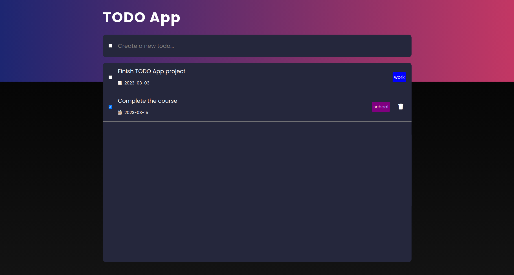

This is a simple TODO App developed with NodeJS, MongoDB.

## Table of contents

- [Overview](#overview)
  - [Screenshot](#screenshot)
  - [Built with](#built-with)
- [Author](#author)

### Screenshot

### Built with

- NodeJS
- ExpressJS
- MongoDB
- EJS

- Semantic HTML5 markup
- CSS
- JavaScript

## Author

Geoffrey
